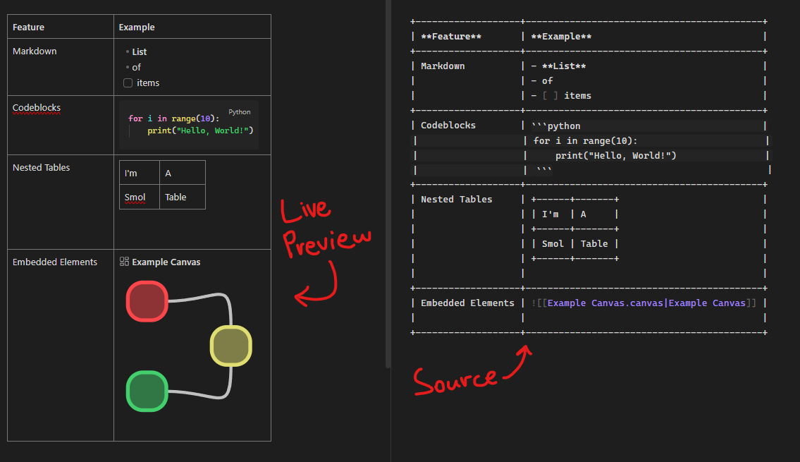
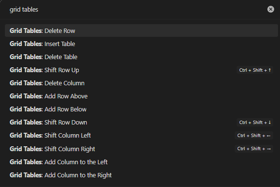

# Obsidian Grid Tables

Edit complex multiline (yet still completely plaintext) tables in [Obsidian](https://obsidian.md).



https://github.com/user-attachments/assets/8f466ad7-51f5-4a17-8dcb-8257050becf4


## Disclaimers

- _This plugin is still in very early stages of development! Things may break or be buggy!_
- _I am not a frontend developer. I have no idea what I'm doing. The plugin's code is, to put it mildly, abhorrent. Any PRs or suggestions are more than welcome_.

## What is this plugin?
This plugin aims to provide a replacement for vanilla Obsidian tables' biggest shortcoming (in my opinion): lacking proper multiline support. The plugin solves this issue by opting for a different (yet still plaintext) table format:

Regular Markdown table format:
```
| Heading 1 | Heading 2 |
| --------- | --------- |
| Row 1.1   | Row 1.2   |
| Row 2.1   | Row 2.2   |
```

The plugin's table format:
```
+-----------+-----------+
| Heading 1 | Heading 2 |
+-----------+-----------+
| Row 1.1   | Row 1.2   |
+-----------+-----------+
| Row 2.1   | Row 2.2   |
+-----------+-----------+
```

This allows the plugin to treat each table cell as its own self-contained editor, and therefore sidesteps the limitations the regular Markdown format comes with.


## Installation
The plugin hasn't been submitted to Obsidian yet, so for now you have to install it manually:
- Download the latest [release](https://github.com/RedSponge/obsidian-grid-tables/releases) and unzip it into your `Vault/.obsidian/plugins` directory.

## Features
- Edit tables with complex, multiline content.
- Each table cell is its own embedded Obsidian editor, so everything works the way you expect!
- Navigate and modify tables using the keyboard, and an extensive set of commands!



## Local Development
```bash
cd MyTestVault/.obsidian/plugins

git clone https://github.com/RedSponge/obsidian-grid-tables.git

cd obsidian-grid-tables

# Start development server (auto rebuild on change)
npm run dev

# There aren't many tests, but few > 0
npm run test
```

### Deployment
I developed this on Windows, so unfortunately there's a `ps1` script and not a `Makefile`.
```powershell
.\build.ps1
```

## Special Thanks
- [Obsidian Kanban](https://github.com/mgmeyers/obsidian-kanban) for the nested Obsidian editor code.
- You for reading this README.
